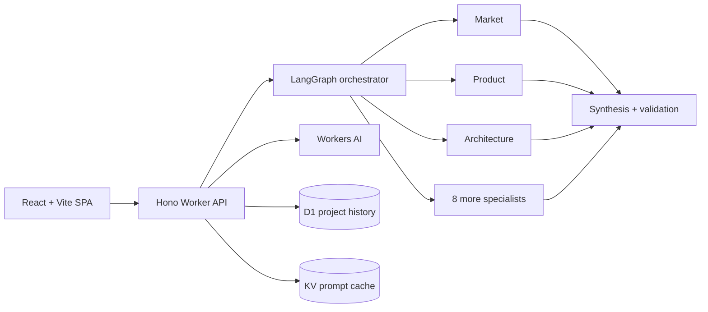

# Product Forge AI

**Your AI product team, working in parallel.**

Product Forge AI turns a product idea into a structured, production-ready proposal in under two minutes. A visible multi-agent workflow fans work out to market, product, UX, architecture, data, API, security, delivery, metrics, and risk specialists, then validates and synthesizes their outputs into one coherent plan.

The result includes a market thesis, competitor map, PRD, user experience, system architecture, SQL schema, OpenAPI contract, roadmap, KPIs, and risk register. Projects are saved to a session-private workspace and can be exported as Markdown, JSON, SQL, OpenAPI, Mermaid, or print-ready PDF.

When an agent exhausts its automatic retries, the graph preserves the failure reason, exposes it on hover, uses a visible specialist fallback, and offers a per-node retry with live progress that re-runs only that agent before re-synthesizing the saved proposal. Structured-output retries use additional response headroom and progressively tighter brevity guidance to avoid repeating truncated JSON. Example briefs populate the entire form and clear the old workspace, while Reset returns the form to a blank idea and constraints with sensible defaults.

## Architecture



The backend remains stateless. D1 is the durable source of truth, KV stores bounded prompt-cache and rate-limit entries, and Workers AI runs the open-weight `Llama 3.1 8B Instruct Fast` model. Every agent response is validated through a shared Zod contract. Failed or quota-limited agents retry with backoff and then degrade to a deterministic, domain-specific fallback so a run can still finish.

## Monorepo

```text
apps/
  api/             Hono Cloudflare Worker, D1/KV/AI bindings
  web/             React, Vite, Tailwind CSS, React Flow, Mermaid
packages/
  contracts/       Shared Zod schemas and TypeScript contracts
  orchestrator/    LangGraph workflow, prompts, fallback, synthesis
docs/
  specs.md         Product specification
```

## Local development

Requirements: Node.js 22+ and a Cloudflare account for remote Workers AI.

```bash
npm install
npm run types
npm run db:migrate:local
```

Run the API and frontend in separate terminals:

```bash
npm run dev:api
npm run dev:web
```

Open `http://localhost:5173`. Vite proxies `/api` to the Worker on port `8787`. Workers AI uses the configured remote binding; D1 and KV remain local unless explicitly configured otherwise.

## Quality checks

```bash
npm run check
npm test
npm run build
npm run deploy:dry
```

Strict TypeScript is enabled across every workspace. Shared contract and synthesis behavior have automated coverage.

## Cloudflare deployment

The application deploys as one Worker with static assets, so frontend files are served without invoking Worker code while `/api/*` routes run at the edge.

1. Create a D1 database and KV namespace:

   ```bash
   npx wrangler d1 create product-forge-ai
   npx wrangler kv namespace create CACHE
   ```

2. Put the returned IDs in `apps/api/wrangler.jsonc`.
3. Apply the migration and deploy:

   ```bash
   npm run db:migrate:remote
   npm run deploy
   ```

The design stays inside the default free allocations for a portfolio workload: static assets are free, Workers have a daily request allocation, D1 and KV have free daily operations, and Workers AI provides 10,000 free neurons per day. If the AI allocation is exhausted, graceful fallbacks keep the product usable. See the current [Workers](https://developers.cloudflare.com/workers/platform/pricing/), [D1](https://developers.cloudflare.com/d1/platform/pricing/), [KV](https://developers.cloudflare.com/kv/platform/pricing/), and [Workers AI](https://developers.cloudflare.com/workers-ai/platform/pricing/) pricing pages before operating at production scale.

## Privacy and safety

- Browser sessions use a random local identifier; no account or third-party analytics is required.
- Inputs are bounded and validated before generation.
- Saved projects are scoped to the session identifier.
- Model output is treated as untrusted data and revalidated before storage.
- Logs contain request metadata and errors, not product brief contents.
- Market figures and recommendations are clearly framed as assumptions requiring validation.

## License

[MIT](LICENSE)
